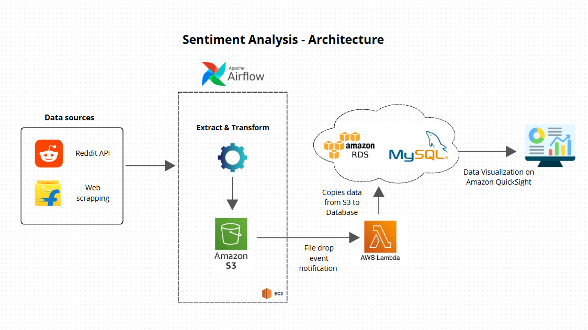
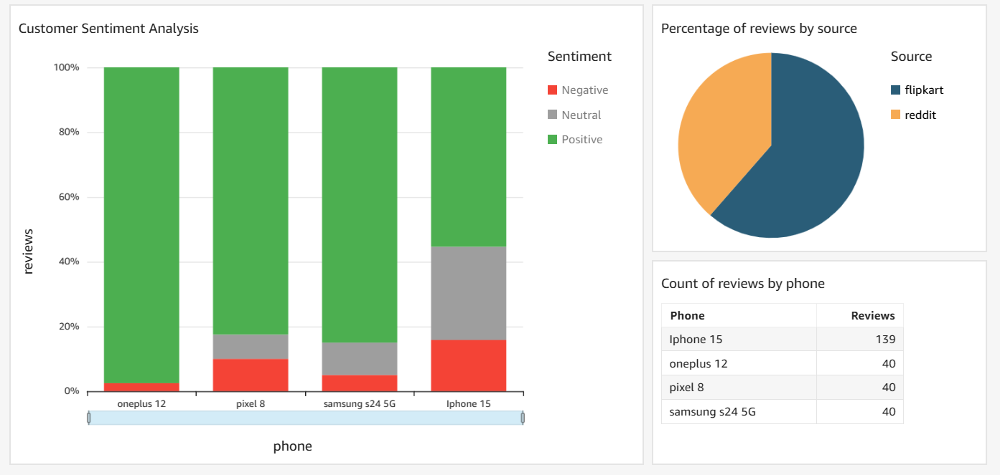

## Project Title: Sentiment Analysis of customer reviews 

### Overview
This project extracts and analyses customer reviews on mobile phones to uncover insights and understand overall sentiment. The goal is to identify trends and key factors influencing customer satisfaction.

### Architecture

### Project Highlights
- Data Extraction: Pulled data from Reddit (API) and Flipkart (web scraping with Beautiful Soup)
- Data Transformation: Cleaned and structured data using Pandas to prepare it for analysis
- Data Loading: Stored transformed data in AWS S3, and automatically transferred it to RDS (MySQL) via AWS Lambda

### Automation & Orchestration:
-	Scheduled monthly ETL pipelines with Apache Airflow, ensuring timely processing of new data
-	Integrated GitHub Actions for CI/CD, automating deployments to an EC2-hosted application
-	Visualized insights using AWS QuickSight, directly connected to RDS

### ETL scripts
1. [Flipkart python file](scripts/flipkart_scrapper.py)
2. [Reddit python file](scripts/reddit_fetcher.py)
3. [Main python file](scripts/sentiment_analysis.py)

### Lambda function
1. [Function to copy data from s3 to Database](lambda.function.py)

### Visualization on AWS QuickSight

### Technologies Used
- Python (for data processing and automation)
- BeautifulSoup (for web scraping Flipkart reviews)
- AWS Services:
  - EC2 
  - S3 (storage for processed data)
  - Lambda (for automatic data movement)
  - RDS MySQL (data storage for final dataset)
  - QuickSight (for visualized insights)
- Apache Airflow (for orchestrating monthly ETL pipelines)
- GitHub Actions (for CI/CD and deployments)
- Pandas (data processing)
